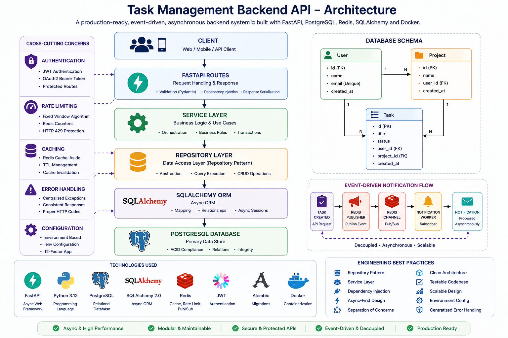

# Task Management Backend API

A production-oriented asynchronous backend system built with FastAPI, PostgreSQL, Redis, SQLAlchemy, Alembic, Docker, and automated API testing.

This project demonstrates modern backend engineering practices including clean architecture, JWT authentication, database migrations, asynchronous programming, Redis-based performance optimization, API protection, event-driven communication, background workers, containerization, asynchronous integration testing and RESTful API design.

---

## Architecture



---

# Features

## Authentication & Security

* JWT Access Tokens
* OAuth2 Bearer Authentication
* Protected API Endpoints
* User Profile Authentication
* API Rate Limiting using Redis
* HTTP 429 Protection for Excessive Requests

---

## User Management

* Create Users
* Retrieve Users by ID
* Retrieve All Users
* Redis Cache-Aside Pattern for User Retrieval
* Cache TTL Management
* Automatic Cache Invalidation after Updates

---

## Project Management

* Create Projects
* Retrieve Projects by ID
* List All Projects
* Associate Projects with Users

---

## Task Management

* Create Tasks
* Retrieve Tasks by ID
* List All Tasks
* Associate Tasks with Users
* Associate Tasks with Projects

---

## Event-Driven Notification System

Task creation events are published asynchronously using Redis Pub/Sub.

Features:

* Redis Publisher
* Redis Subscriber
* Background Notification Worker
* Decoupled Service Communication
* Asynchronous Event Processing

---

## Database

* PostgreSQL Database
* SQLAlchemy 2.0 ORM
* Async Database Sessions
* Relational Database Modeling
* Foreign Key Relationships
* Alembic Database Migrations

---

## Backend Engineering Practices

* Repository Pattern
* Service Layer Architecture
* Dependency Injection
* Async-First Design
* Separation of Concerns
* Testable Application Architecture
* Centralized Error Handling
* Environment-Based Configuration
* Database Session Lifecycle Management
* Multi-Container Docker Architecture
---

# Testing

The project includes asynchronous API integration testing using:

* Pytest
* Pytest-Asyncio
* HTTPX AsyncClient
* FastAPI Dependency Overrides
* Dedicated PostgreSQL Test Database

## Current Test Coverage

### User API

* Create User Endpoint
* Retrieve All Users Endpoint

### Validation Coverage

* Database Session Management
* Dependency Injection Overrides
* Async Request Lifecycle
* PostgreSQL Integration
* SQLAlchemy Async Operations

## Test Architecture

```text
Pytest
   |
   v
HTTPX AsyncClient
   |
   v
FastAPI Application
   |
Dependency Override
   |
   v
Test PostgreSQL Database
```

## Run Tests

```bash
pytest tests -v
```

# Technology Stack

## Backend

* Python 3.12
* FastAPI
* Pydantic

## Database

* PostgreSQL
* SQLAlchemy 2.0
* AsyncPG

## Caching & Messaging

* Redis
* Redis Cache
* Redis Pub/Sub
* Redis Counters

## Authentication

* JWT
* OAuth2 Password Bearer

## Infrastructure

* Docker
* Docker Compose
* Multi-Container Services

## Database Migration

* Alembic

---

# High-Level System Architecture

```text
                          Client
                             |
                             v
                        FastAPI API
                             |
        ------------------------------------------------
        |                       |                      |
        v                       v                      v
   Service Layer            Redis                 PostgreSQL
                                |
                --------------------------------
                |              |               |
                v              v               v
             Caching      Rate Limiting     Pub/Sub
                                                |
                                                v
                                   Notification Worker
```

---

# Database Design

## Users Table

```text
User
├── id
├── name
├── email
└── created_at
```

---

## Projects Table

```text
Project
├── id
├── name
├── user_id
└── created_at
```

---

## Tasks Table

```text
Task
├── id
├── title
├── status
├── user_id
├── project_id
└── created_at
```

---

# Database Relationships

```text
User
│
├── Projects (One-to-Many)
│
└── Tasks (One-to-Many)

Project
│
└── Tasks (One-to-Many)
```

---

# API Endpoints

## Authentication

### Login

```http
POST /login
```

Returns a JWT access token.

---

### Profile

```http
GET /profile
```

Requires Bearer authentication.

---

## Users

### Create User

```http
POST /users
```

Example:

```json
{
  "name": "John Doe",
  "email": "john@example.com"
}
```

---

### Get User

```http
GET /users/{user_id}
```

Protected endpoint with Redis rate limiting and caching.

---

### Get All Users

```http
GET /users
```

---

## Projects

### Create Project

```http
POST /projects
```

Example:

```json
{
  "name": "Backend System",
  "user_id": 1
}
```

---

### Get Project

```http
GET /projects/{project_id}
```

---

### List Projects

```http
GET /projects
```

---

## Tasks

### Create Task

```http
POST /tasks
```

Example:

```json
{
  "title": "Implement Redis Pub/Sub",
  "user_id": 1,
  "project_id": 1
}
```

This endpoint triggers an asynchronous Redis Pub/Sub event consumed by the notification worker.

---

### Get Task

```http
GET /tasks/{task_id}
```

---

### List Tasks

```http
GET /tasks
```

---

# Redis Implementation

## 1. Redis Caching

Implemented using the Cache-Aside Pattern:

```text
Request
   |
   v
Redis Cache
   |
Cache Hit  -> Return Data

Cache Miss -> PostgreSQL -> Store in Redis
```

---

## 2. Cache Invalidation

To maintain consistency:

```text
Update PostgreSQL
        |
        v
Delete Redis Cache Key
```

Database remains the source of truth.

---

## 3. Fixed Window Rate Limiting

Implemented using Redis atomic operations:

* INCR
* EXPIRE
* TTL

Flow:

```text
Request
   |
Redis Counter
   |
Allowed Request
   |
OR
   |
HTTP 429 Too Many Requests
```

---

## 4. Redis Pub/Sub Messaging

```text
Task Created
     |
     v
Redis Publisher
     |
     v
Redis Channel
     |
     v
Notification Worker
```

Enables asynchronous, loosely coupled communication between services.

---

# Running with Docker

Build and start all services:

```bash
docker compose up --build
```

Containers:

* FastAPI API
* PostgreSQL Database
* Redis Server
* Notification Worker

---

# Database Migrations

Create a migration:

```bash
alembic revision --autogenerate -m "migration message"
```

Apply migrations:

```bash
alembic upgrade head
```

Rollback the last migration:

```bash
alembic downgrade -1
```

---

# Environment Variables

Create a `.env` file:

```env
DATABASE_URL=postgresql+asyncpg://postgres:password@db:5432/task_manager

POSTGRES_USER=postgres
POSTGRES_PASSWORD=password
POSTGRES_DB=task_manager

SECRET_KEY=your-secret-key
ALGORITHM=HS256
ACCESS_TOKEN_EXPIRE_MINUTES=30
```

---

# Local Development

Install dependencies:

```bash
pip install -r requirements.txt
```

Run the development server:

```bash
uvicorn main:app --reload
```

API Documentation:

Swagger UI:

```text
http://localhost:8000/docs
```

ReDoc:

```text
http://localhost:8000/redoc
```

---

# Project Structure

```text
project/
│
├── main.py
├── config.py
├── database.py
│
├── auth.py
├── redis_client.py
├── rate_limiter.py
├── publisher.py
├── subscriber.py
│
├── models.py
├── schemas.py
│
├── user_repository.py
├── project_repository.py
├── task_repository.py
│
├── user_service.py
├── project_service.py
├── task_service.py
│
├── alembic/
│
├── Dockerfile
├── docker-compose.yml
│
└── requirements.txt
```

---

# Engineering Highlights

This project demonstrates production-oriented backend engineering practices:

✅ Async FastAPI Architecture

✅ PostgreSQL + SQLAlchemy Async ORM

✅ Repository and Service Layer Pattern

✅ Dependency Injection

✅ JWT Authentication

✅ Redis Caching

✅ Redis Pub/Sub Messaging

✅ Fixed Window Rate Limiting

✅ Alembic Database Migrations

✅ Docker Multi-Container Deployment

✅ API Integration Testing

✅ Dedicated Test Database

✅ Clean Layered Architecture

---

# Learning Outcomes

This project provided practical experience with:

* Production-Style FastAPI Development
* REST API Design
* Async Python Programming
* PostgreSQL Database Design
* SQLAlchemy Async ORM
* Database Migrations with Alembic
* JWT Authentication & OAuth2 Security
* Repository and Service Layer Architecture
* Dependency Injection
* Redis Caching Strategies
* Cache Invalidation Techniques
* API Rate Limiting Algorithms
* Event-Driven Architecture
* Redis Pub/Sub Messaging
* Background Worker Design
* Docker Multi-Container Applications
* Environment-Based Configuration
* Scalable Backend System Design

---

# Future Improvements

Planned enhancements include:

* Test Coverage Expansion
    * Project APIs
    * Task APIs
    * Authentication APIs
    * Rate Limiting Validation
    * Redis Cache Validation

* CI/CD Pipelines using GitHub Actions

* Structured Logging

* Application Metrics and Monitoring

* Celery-Based Distributed Background Jobs

* Redis Streams and Consumer Groups

* Kubernetes Deployment

* Cloud Deployment (AWS/GCP/Azure)

* OpenTelemetry Distributed Tracing
---

## Final Note

This project evolved from a basic CRUD API into a production-oriented backend system demonstrating real-world engineering concepts such as caching, asynchronous communication, API protection, and scalable service design.
