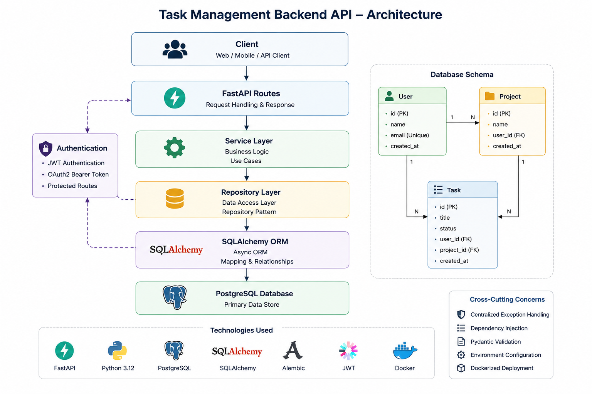

# Task Management Backend API

A production-style backend application built with FastAPI, PostgreSQL, SQLAlchemy, Alembic, and Docker.

This project demonstrates modern backend engineering practices including layered architecture, JWT authentication, database migrations, ORM relationships, dependency injection, containerization, and RESTful API design.

## Architecture


---

## Features

### Authentication

* JWT Access Tokens
* OAuth2 Bearer Authentication
* Protected Endpoints
* User Profile Retrieval

### User Management

* Create User
* Get User By ID
* List All Users

### Project Management

* Create Project
* Get Project By ID
* List All Projects
* Associate Projects with Users

### Task Management

* Create Task
* Get Task By ID
* List All Tasks
* Associate Tasks with Users
* Associate Tasks with Projects

### Database

* PostgreSQL
* SQLAlchemy ORM
* Async Database Sessions
* Foreign Key Relationships
* Alembic Database Migrations

### Engineering Practices

* Repository Pattern
* Service Layer Pattern
* Dependency Injection
* Centralized Exception Handling
* Dockerized Deployment
* Environment Variable Configuration

---

## Tech Stack

### Backend

* FastAPI
* Python 3.12
* Pydantic

### Database

* PostgreSQL
* SQLAlchemy 2.0
* AsyncPG

### Authentication

* JWT
* OAuth2

### Infrastructure

* Docker
* Docker Compose

### Migrations

* Alembic

---

## System Architecture

```text
Client
  │
  ▼
FastAPI Routes
  │
  ▼
Service Layer
  │
  ▼
Repository Layer
  │
  ▼
SQLAlchemy ORM
  │
  ▼
PostgreSQL
```

---

## Database Design

### Users

```text
User
├── id
├── name
├── email
└── created_at
```

### Projects

```text
Project
├── id
├── name
├── user_id
└── created_at
```

### Tasks

```text
Task
├── id
├── title
├── status
├── user_id
├── project_id
└── created_at
```

---

## Relationships

```text
User
│
├── Projects
│
└── Tasks

Project
│
└── Tasks
```

### Relationship Types

* One User → Many Projects
* One User → Many Tasks
* One Project → Many Tasks

---

## API Endpoints

### Authentication

#### Login

```http
POST /login
```

Returns JWT access token.

#### Profile

```http
GET /profile
```

Protected endpoint.

---

### Users

#### Create User

```http
POST /users
```

Request:

```json
{
  "name": "John Doe",
  "email": "john@example.com"
}
```

#### Get User

```http
GET /users/{user_id}
```

#### Get All Users

```http
GET /users
```

---

### Projects

#### Create Project

```http
POST /projects
```

Request:

```json
{
  "name": "Task Manager",
  "user_id": 1
}
```

#### Get Project

```http
GET /projects/{project_id}
```

#### Get All Projects

```http
GET /projects
```

---

### Tasks

#### Create Task

```http
POST /tasks
```

Request:

```json
{
  "title": "Implement Authentication",
  "user_id": 1,
  "project_id": 1
}
```

#### Get Task

```http
GET /tasks/{task_id}
```

#### Get All Tasks

```http
GET /tasks
```

---

## Database Migrations

Create migration:

```bash
alembic revision --autogenerate -m "migration message"
```

Apply migration:

```bash
alembic upgrade head
```

Rollback migration:

```bash
alembic downgrade -1
```

---

## Running with Docker

Build and start services:

```bash
docker compose up --build
```

Services:

```text
FastAPI API
PostgreSQL Database
```

---

## Environment Variables

Create a `.env` file:

```env
DATABASE_URL=postgresql+asyncpg://postgres:password@db:5432/task_manager

POSTGRES_USER=postgres
POSTGRES_PASSWORD=password
POSTGRES_DB=task_manager

SECRET_KEY=your-secret-key
ALGORITHM=HS256
ACCESS_TOKEN_EXPIRE_MINUTES=30
```

---

## Local Development

Install dependencies:

```bash
pip install -r requirements.txt
```

Run server:

```bash
uvicorn main:app --reload
```

Swagger Documentation:

```text
http://localhost:8000/docs
```

ReDoc Documentation:

```text
http://localhost:8000/redoc
```

---

## Project Structure

```text
project/
│
├── main.py
├── database.py
├── config.py
│
├── models.py
├── schemas.py
│
├── auth.py
│
├── user_repository.py
├── project_repository.py
├── task_repository.py
│
├── user_service.py
├── project_service.py
├── task_service.py
│
├── alembic/
│
├── Dockerfile
├── docker-compose.yml
│
└── requirements.txt
```

---

## Learning Outcomes

This project was built to gain hands-on experience with:

* FastAPI Development
* REST API Design
* PostgreSQL
* SQLAlchemy ORM
* Async Database Programming
* Alembic Migrations
* JWT Authentication
* Dependency Injection
* Repository Pattern
* Service Layer Architecture
* Docker & Docker Compose
* Production-Oriented Backend Development

```
```
